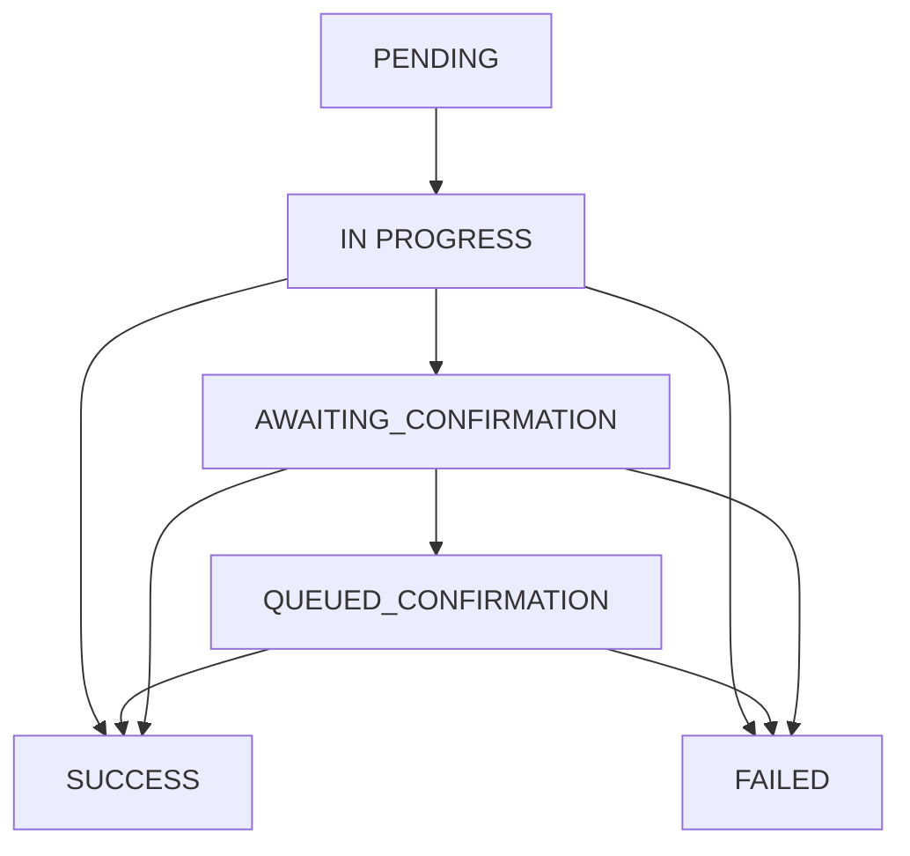

# Delivery Status Lifecycle

This document explains the lifecycle of a notification created using OsmoX and the various delivery status states.

## Lifecycle Diagram

<Frame>
  
</Frame>

## Delivery Status Values

| Status | Value | Description |
|--------|-------|-------------|
| **PENDING** | 1 | The notification is awaiting processing |
| **IN PROGRESS** | 2 | The notification is currently being sent |
| **AWAITING_CONFIRMATION** | 3 | The notification is awaiting delivery confirmation from the provider |
| **QUEUED_CONFIRMATION** | 4 | The notification is added to the confirmation queue |
| **SUCCESS** | 5 | The notification was successfully delivered |
| **FAILED** | 6 | The notification delivery failed |

## Status Flow

<Steps>
  <Step title="PENDING (1)">
    When a notification is created via the API, it starts in the `PENDING` status. The notification is stored in the database and waits to be picked up by the scheduler.
  </Step>

  <Step title="IN PROGRESS (2)">
    The scheduler picks up pending notifications and adds them to their respective channel queues. Once a queue worker starts processing, the status changes to `IN PROGRESS`.
  </Step>

  <Step title="AWAITING_CONFIRMATION (3)">
    After the notification is sent to the provider, if the provider supports delivery confirmation, the status changes to `AWAITING_CONFIRMATION`. This means OsmoX is waiting for the provider to confirm successful delivery.
  </Step>

  <Step title="QUEUED_CONFIRMATION (4)">
    The notification is added to a confirmation queue for periodic status checks with the provider.
  </Step>

  <Step title="SUCCESS (5)">
    The notification was successfully delivered to the recipient. This is a terminal state.
  </Step>

  <Step title="FAILED (6)">
    The notification delivery failed after all retry attempts. This is a terminal state.
  </Step>
</Steps>

## Status Transitions

## Provider Confirmation Support

Not all providers support delivery confirmation. The behavior depends on the provider:

<CardGroup cols={2}>
  <Card title="Providers with Confirmation" icon="check">
    - Mailgun
    - Twilio SMS
    - Twilio WhatsApp

    These providers go through the full AWAITING_CONFIRMATION flow
  </Card>
  <Card title="Providers without Confirmation" icon="minus">
    - SMTP
    - 360Dialog

    These providers skip directly to SUCCESS or FAILED after sending
  </Card>
</CardGroup>

## Archival Process

Once a notification reaches a terminal state (`SUCCESS` or `FAILED`), the scheduler eventually moves it from the `notify_notifications` table to the `notify_archived_notifications` table.

<Note>
  The archival process runs periodically based on your scheduler configuration. Archived notifications can still be queried via the archived notifications API.
</Note>

## Tracking Status

You can track notification status in several ways:

1. **API Query**: Use the GraphQL API to fetch notification status by ID
2. **Webhooks**: Configure webhooks to receive real-time status updates
3. **Database**: Query the `notify_notifications` or `notify_archived_notifications` tables directly

## Retry Behavior

When a notification fails:

1. The `retry_count` is incremented
2. The notification is re-queued for another attempt
3. After max retries, the status is set to `FAILED`

<Info>
  The retry count and failure details are stored in the `result` field as JSON.
</Info>
