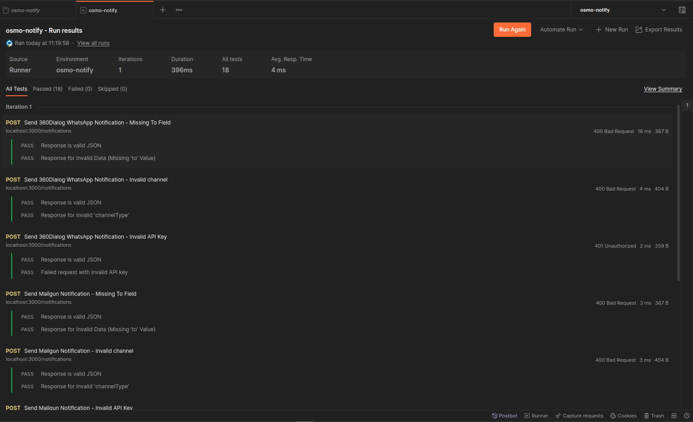
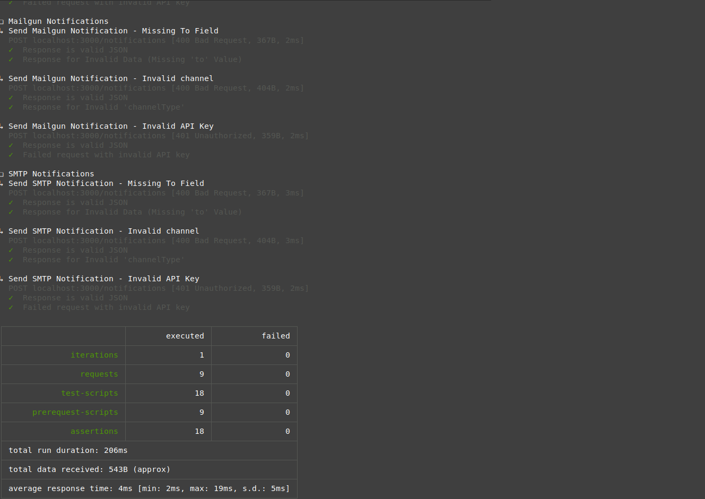
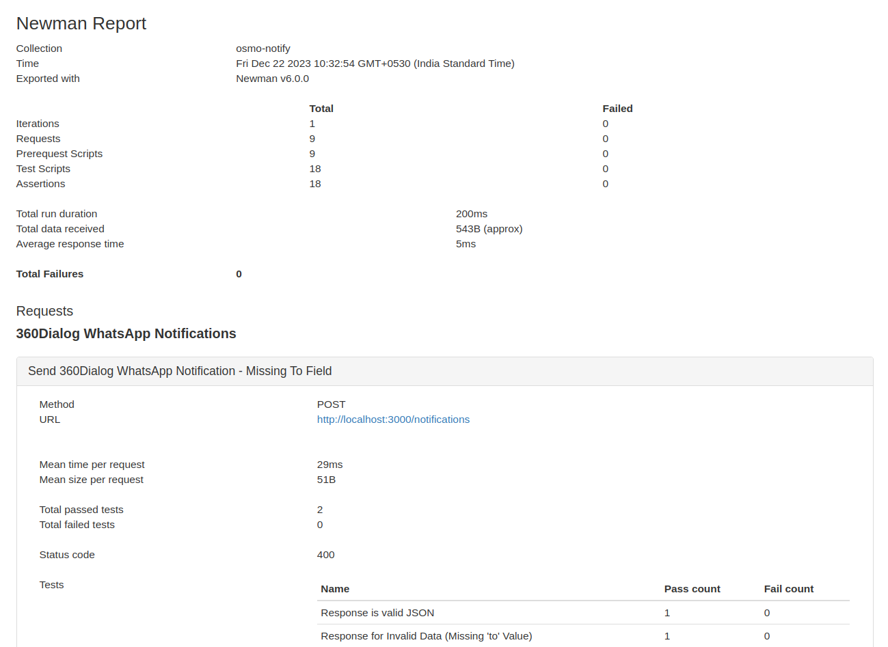

# API Test Cases Documentation

This document provides instructions on how to run the API test cases using Postman and Newman.

## Prerequisites

Before running the test cases, make sure you have the following prerequisites installed:

- [Postman](https://www.postman.com/downloads/)
- [Node.js](https://nodejs.org/) (v20.x or higher)

## Getting Started

1. Clone the repository (if not already done):

   ```bash
   git clone git@github.com:OsmosysSoftware/osmo-x.git
   ```

2. Install Newman globally (for using Newman):

   ```bash
   npm install -g newman

   # Optional, for generating HTML reports
   npm install -g newman-reporter-html
   ```

3. Import the Postman collection:

   1. Open Postman.
   2. Click on the `Import` button.
   3. Select the `apps/api/OsmoX.postman_collection.json` file.

## Running Test Cases

### Using Postman

1. Open Postman.
2. Select the imported collection and click on the `Run` button near the top right.

   Alternatively, click the three dots beside the collection name and click `Run collection`

3. Select the environment on top right.
4. Click `Run OsmoX` to execute the test cases.

### Using Newman

1.  Export the environment file from Postman.
2.  Open a terminal and run one of the following commands:

    1. For console output

       ```bash
       newman run OsmoX.postman_collection.json -e OsmoX.postman_environment.json
       ```

    2. For HTML report

       ```bash
       newman run OsmoX.postman_collection.json -e OsmoX.postman_environment.json -r html
       ```

    Specify the path to the collection and environment file as required.

## Viewing Results

Both Postman and Newman provide detailed reports after running the test cases. You can view:

- **Run results (for Postman):** Check the results on the Run results page in Postman after testing is completed.

  

- **Console Output (for Newman):** Check the terminal/console for test execution details.

  

- **HTML Report (for Newman):** After running Newman with the `-r html` flag, an HTML report is generated. Open the `newman/` directory and find the HTML file.

  
