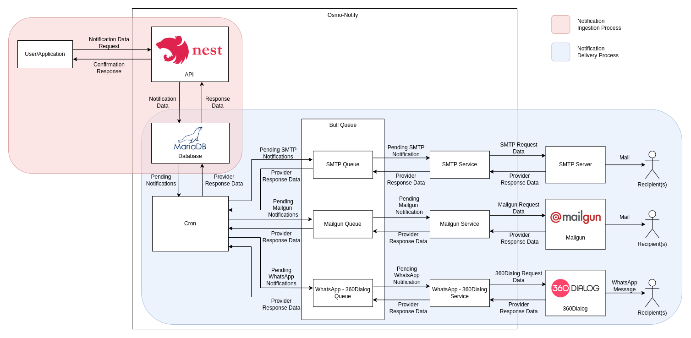

# Block Diagram

## Introduction

This document provides a concise block diagram illustrating the architecture of our software application, OsmoX. The diagram outlines the key components and their interactions to help you better understand how the application functions.

## Block Diagram Overview

The block diagram represents the software application's architecture in a visual format, making it easier to grasp its structure and functionality.

## Block Diagram

## Components and Functionalities

### 1. User/Application

This component is responsible for making the request to the OsmoX API with required details about the notification.

### 2. API

The core component of project created with NestJS, this is responsible for accepting the incoming requests made by the user/application for creating a notification. A response is sent back to the user/application to signify if the notification was created successfully or if any errors were encountered.

Upon receiving the request, the API stores the received details in the database.

### 3. Database

The MariaDB database is responsible for holding the records of different notifications that have been created along with all other required details about them such as the request body, delivery status, notification channel type, response data, etc. Additionally, database migrations are also stored in this database. The notifications in database are updated with the response received from the provider used upon delivery success/failure.

### 4. Cron

A scheduled cron fetches all the notifications in the pending status from the database and add their IDs to their corresponding queues for processing.

### 5. Queues

For each supported notification channel type, a separate queue is maintained to allow parallel processing of notifications of different channels. These queues are implemented using Bull Queue (which itself uses Redis). The queue receives the ID of the notification to be sent and fetches details about it from the database using this ID to pass it onto the corresponding service.

### 6. Services

Notifications are processed one-by-one from the different queues and details are passed on to their respective services for performing the required actions for sending the notification. The services hold the business logic for sending the notification. Upon sending the notification, the response is sent back to update the notification details in the database.

## Conclusion

This block diagram serves as a valuable resource for understanding the architecture of our software application. It highlights the core components, their interactions, and the flow of data within the application.
