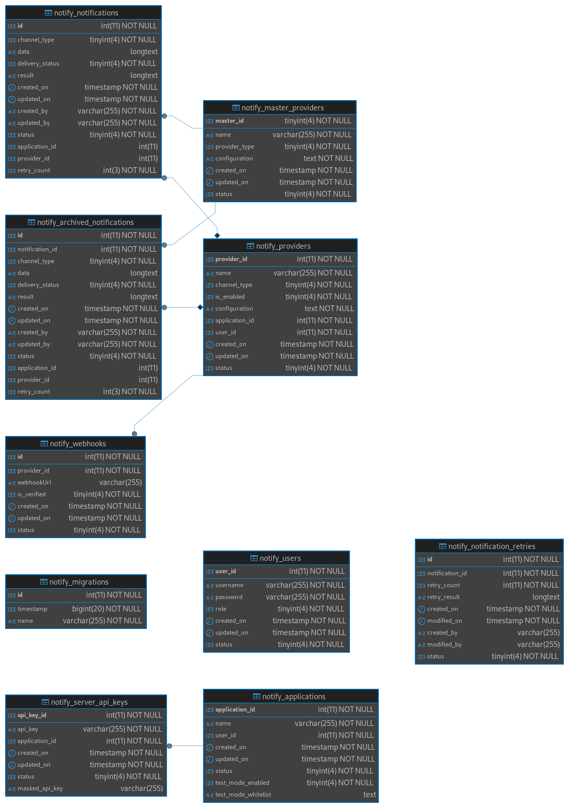

# Database Design

This document provides a comprehensive and structured overview of the database design for OsmoX.

It serves as a reference guide for stakeholders, including developers, database administrators, project managers, and other parties involved in the development, maintenance, and understanding of the application's database.

The tables discussed below are created as part of the database migration.

## Database Schema

The database schema consists of the following tables:

- **notify_applications:** Contains details about all the current applications
- **notify_archived_notifications:** Contains details about all the completed notifications that have been archived
- **notify_master_providers:** Contains details about the basic provider types and configuration JSON
- **notify_migrations:** Contains the migration records
- **notify_notification_retries:** Contains details of retries
- **notify_notifications:** Contains details about all the notifications created
- **notify_providers:** Contains details about all the different providers, along with their configurations
- **notify_server_api_keys:** Contains details about different API keys for the different applications
- **notify_users:** Contains details about all the users
- **notify_webhooks:** Contains webhook urls for providers

This schema can be visualized in the following image:



The ERD diagram file for this schema can be accessed [here](./assets/OsmoX_database_schema.erd).

## Data Dictionary

### notify_applications

| Attribute            | Data Type    | Not Null | Default             | Description                                                                    |
| -------------------- | ------------ | -------- | ------------------- | ------------------------------------------------------------------------------ |
| application_id       | integer      | True     |                     | Primary key, unique identifier for the application                             |
| name                 | varchar(255) | True     |                     | Name of the application                                                        |
| user_id              | integer      | True     |                     | User ID of the user associated with this application                           |
| created_on           | timestamp    | True     | current_timestamp() | Stores the timestamp for the creation of the notification                      |
| updated_on           | timestamp    | True     | current_timestamp() | Stores the timestamp for the last update to the notification                   |
| status               | smallint     | True     | 1                   | Stores whether the notification must be considered as active(1) or inactive(0) |
| test_mode_enabled    | smallint     | True     | 0                   | Stores whether test mode is enabled(1) or disabled(0) for the application      |
| whitelist_recipients | jsonb        | False    | NULL                | Stores whitelisted recipients for application providers in JSON format         |

### notify_archived_notifications

| Attribute            | Data Type    | Not Null | Default             | Description                                                                                                                                                                                                    |
| -------------------- | ------------ | -------- | ------------------- | -------------------------------------------------------------------------------------------------------------------------------------------------------------------------------------------------------------- |
| id                   | integer      | True     |                     | Primary key, stores the id value for different archived notifications                                                                                                                                          |
| notification_id      | integer      | True     |                     | Indexed. Stores the original id value of the notification                                                                                                                                                      |
| channel_type         | smallint     | True     |                     | Foreign Key. Identifier for related master_provider. Stores the channel type used for the notification. Can be a value from [Available Channel Types](./usage-guide.md#6-available-channel-type-end-providers) |
| data                 | jsonb        | True     |                     | Stores JSON data about the notification such as the from/to addresses, subject and body content                                                                                                                |
| delivery_status      | smallint     | True     | 1                   | Indexed. Stores the current delivery status of the notification. Can be a value from [Delivery Status Information](./usage-guide.md#7-delivery-status-information)                                             |
| result               | jsonb        | False    | NULL                | Stores the JSON result after attempting to send the notification                                                                                                                                               |
| created_on           | timestamp    | True     | current_timestamp() | Stores the timestamp for the creation of the notification                                                                                                                                                      |
| updated_on           | timestamp    | True     | current_timestamp() | Stores the timestamp for the last update to the notification                                                                                                                                                   |
| created_by           | varchar(255) | True     |                     | Stores the name of the service/app that created the notification                                                                                                                                               |
| updated_by           | varchar(255) | True     |                     | Stores the name of the service/app that last updated the notification                                                                                                                                          |
| status               | smallint     | True     | 1                   | Stores whether the notification must be considered as active(1) or inactive(0)                                                                                                                                 |
| application_id       | integer      | False    | NULL                | Stores the id value for related application_id                                                                                                                                                                 |
| provider_id          | integer      | False    | NULL                | Foreign key. Identifier for related provider. Stores the id value for related active provider                                                                                                                  |
| retry_count          | integer      | True     | 0                   | Identifies the retry count for the notification                                                                                                                                                                |
| notification_sent_on | timestamp    | False    | NULL                | Stores the time when notification was sent to end provider for processing                                                                                                                                      |

### notify_master_providers

| Attribute     | Data Type    | Not Null | Default             | Description                                                                                                                                                                                                                           |
| ------------- | ------------ | -------- | ------------------- | ------------------------------------------------------------------------------------------------------------------------------------------------------------------------------------------------------------------------------------- |
| master_id     | smallint     | True     |                     | Primary key, unique identifier for the provider                                                                                                                                                                                       |
| name          | varchar(255) | True     |                     | Name of the provider                                                                                                                                                                                                                  |
| provider_type | smallint     | True     | 1                   | The type of the provider, e.g., SMS, Email, WhatsApp, etc                                                                                                                                                                             |
| configuration | jsonb        | True     |                     | Master JSON data for storing configuration details for this provider, to be used in frontend. This will be storing what all values need to be provided for setting up a provider. [Example pattern](#example-pattern-master-provider) |
| created_on    | timestamp    | True     | current_timestamp() | Stores the timestamp for the creation of the notification                                                                                                                                                                             |
| updated_on    | timestamp    | True     | current_timestamp() | Stores the timestamp for the last update to the notification                                                                                                                                                                          |
| status        | smallint     | True     | 1                   | Stores whether the notification must be considered as active(1) or inactive(0)                                                                                                                                                        |

#### Example pattern master provider

Consider a pattern like this:

```jsonc
{
  "apikey": {
    "label": "API Key",
    "id": "apikey",
    "pattern": "^[0-19]10$",
    "type": "number",
  },
  "apikey2": "value2", // Additional key-value entries
}
```

[Back to notify_master_providers](#notify_master_providers)

### notify_migrations

| Attribute | Data Type    | Not Null | Default | Description                                                    |
| --------- | ------------ | -------- | ------- | -------------------------------------------------------------- |
| id        | integer      | True     |         | Primary key, stores the id value for different migrations      |
| timestamp | timestamp    | True     |         | Stores the timestamp for when the migration record was created |
| name      | varchar(255) | True     |         | Stores the name of the migration ran                           |

### notify_notification_retries

| Attribute       | Data Type | Not Null | Default             | Description                                                                    |
| --------------- | --------- | -------- | ------------------- | ------------------------------------------------------------------------------ |
| id              | integer   | True     |                     | Primary key, unique identifier for notification retry                          |
| notification_id | integer   | True     |                     | Unique identifier for id of notification in retry loop                         |
| retry_count     | integer   | True     |                     | Identifies retry number                                                        |
| retry_result    | jsonb     | False    | NULL                | Contains retry result                                                          |
| created_on      | timestamp | True     | current_timestamp() | Stores the timestamp for the creation of the notification                      |
| updated_on      | timestamp | True     | current_timestamp() | Stores the timestamp for the last update to the notification                   |
| status          | smallint  | True     | 1                   | Stores whether the notification must be considered as active(1) or inactive(0) |

### notify_notifications

| Attribute            | Data Type    | Not Null | Default             | Description                                                                                                                                                                                                    |
| -------------------- | ------------ | -------- | ------------------- | -------------------------------------------------------------------------------------------------------------------------------------------------------------------------------------------------------------- |
| id                   | integer      | True     |                     | Primary key, stores the id value for different notifications                                                                                                                                                   |
| channel_type         | smallint     | True     |                     | Foreign Key. Identifier for related master_provider. Stores the channel type used for the notification. Can be a value from [Available Channel Types](./usage-guide.md#6-available-channel-type-end-providers) |
| data                 | jsonb        | True     |                     | Stores JSON data about the notification such as the from/to addresses, subject and body content                                                                                                                |
| delivery_status      | smallint     | True     | 1                   | Stores the current delivery status of the notification. Can be a value from [Delivery Status Information](./usage-guide.md#7-delivery-status-information)                                                      |
| result               | jsonb        | False    | NULL                | Stores the JSON result after attempting to send the notification                                                                                                                                               |
| created_on           | timestamp    | True     | current_timestamp() | Stores the timestamp for the creation of the notification                                                                                                                                                      |
| updated_on           | timestamp    | True     | current_timestamp() | Stores the timestamp for the last update to the notification                                                                                                                                                   |
| created_by           | varchar(255) | True     |                     | Stores the name of the service/app that created the notification                                                                                                                                               |
| updated_by           | varchar(255) | True     |                     | Stores the name of the service/app that last updated the notification                                                                                                                                          |
| status               | smallint     | True     | 1                   | Stores whether the notification must be considered as active(1) or inactive(0)                                                                                                                                 |
| application_id       | integer      | False    | NULL                | Stores the id value for related application_id                                                                                                                                                                 |
| provider_id          | integer      | False    | NULL                | Foreign key. Identifier for related provider. Stores the id value for related active provider                                                                                                                  |
| retry_count          | integer      | True     | 0                   | Identifies the retry count for the notification                                                                                                                                                                |
| notification_sent_on | timestamp    | False    | NULL                | Stores the time when notification was sent to end provider for processing                                                                                                                                      |

### notify_providers

| Attribute      | Data Type    | Not Null | Default             | Description                                                                                                                                                                                                                    |
| -------------- | ------------ | -------- | ------------------- | ------------------------------------------------------------------------------------------------------------------------------------------------------------------------------------------------------------------------------ |
| provider_id    | smallint     | True     |                     | Primary key, unique identifier for the provider                                                                                                                                                                                |
| name           | varchar(255) | True     |                     | Name of the provider                                                                                                                                                                                                           |
| channel_type   | smallint     | True     |                     | Stores the channel type used for the notification. Can be a value from [Available Channel Types](./usage-guide.md#6-available-channel-type-end-providers)                                                                      |
| is_enabled     | smallint     | True     |                     | Stores whether the provider is enabled or not                                                                                                                                                                                  |
| configuration  | jsonb        | True     |                     | Master JSON data for storing configuration details for this provider, to be used in frontend. This will be storing what all values need to be provided for setting up a provider. [Example pattern](#example-pattern-provider) |
| application_id | integer      | True     |                     | Unique identifier for the application                                                                                                                                                                                          |
| user_id        | integer      | True     |                     | User ID of the user associated with this application                                                                                                                                                                           |
| created_on     | timestamp    | True     | current_timestamp() | Stores the timestamp for the creation of the notification                                                                                                                                                                      |
| updated_on     | timestamp    | True     | current_timestamp() | Stores the timestamp for the last update to the notification                                                                                                                                                                   |
| status         | smallint     | True     | 1                   | Stores whether the notification must be considered as active(1) or inactive(0)                                                                                                                                                 |

#### Example pattern provider

Consider a pattern like this:

```jsonc
{
  "SMTP_HOST": "some.smtp.host",
  "SMTP_PORT": 123,
  "SMTP_USERNAME": "someusername",
  "SMTP_PASSWORD": "somepassword",
}
```

[Back to notify_providers](#notify_providers)

### notify_server_api_keys

| Attribute      | Data Type    | Not Null | Default             | Description                                                                    |
| -------------- | ------------ | -------- | ------------------- | ------------------------------------------------------------------------------ |
| api_key_id     | integer      | True     |                     | Primary key, unique identifier for the server API key                          |
| api_key        | varchar(255) | True     |                     | Server API key for this application. Unique for each application               |
| application_id | integer      | True     |                     | Foreign key, identifier for the application                                    |
| created_on     | timestamp    | True     | current_timestamp() | Stores the timestamp for the creation of the notification                      |
| updated_on     | timestamp    | True     | current_timestamp() | Stores the timestamp for the last update to the notification                   |
| status         | smallint     | True     | 1                   | Stores whether the notification must be considered as active(1) or inactive(0) |

### notify_users

| Attribute  | Data Type    | Not Null | Default             | Description                                                                    |
| ---------- | ------------ | -------- | ------------------- | ------------------------------------------------------------------------------ |
| user_id    | integer      | True     |                     | Primary key, unique identifier for the user                                    |
| username   | varchar(255) | True     |                     | Username of the user                                                           |
| password   | varchar(255) | True     |                     | Hashed password of the user                                                    |
| role       | smallint     | True     | 0                   | Role of the user: BASIC (0) or ADMIN (1)                                       |
| created_on | timestamp    | True     | current_timestamp() | Stores the timestamp for the creation of the notification                      |
| updated_on | timestamp    | True     | current_timestamp() | Stores the timestamp for the last update to the notification                   |
| status     | smallint     | True     | 1                   | Stores whether the notification must be considered as active(1) or inactive(0) |

### notify_webhooks

Guide on [Webhook Integration](./webhook-guide.md)

| Attribute   | Data Type    | Not Null | Default             | Description                                                                    |
| ----------- | ------------ | -------- | ------------------- | ------------------------------------------------------------------------------ |
| id          | integer      | True     |                     | Primary key, unique identifier for the webhook                                 |
| provider_id | integer      | True     |                     | Foreign key, unique identifier for the provider                                |
| webhookUrl  | varchar(255) | False    | NULL                | Contains webhook url to be triggered                                           |
| is_verified | smallint     | True     | 0                   | Identifies if the webhook has been verified or not                             |
| created_on  | timestamp    | True     | current_timestamp() | Stores the timestamp for the creation of the notification                      |
| updated_on  | timestamp    | True     | current_timestamp() | Stores the timestamp for the last update to the notification                   |
| status      | smallint     | True     | 1                   | Stores whether the notification must be considered as active(1) or inactive(0) |

### notify_provider_types

| Attribute        | Data Type    | Not Null | Default             | Description                                                                    |
| ---------------- | ------------ | -------- | ------------------- | ------------------------------------------------------------------------------ |
| provider_type_id | serial4      | True     |                     | Primary key, unique identifier for the provider_type_id                        |
| name             | varchar(255) | True     |                     | Name of the provider type                                                      |
| description      | text         | False    |                     |                                                                                | Add optional description for provider_type |
| created_on       | timestamp    | True     | current_timestamp() | Stores the timestamp for the creation of the notification                      |
| updated_on       | timestamp    | True     | current_timestamp() | Stores the timestamp for the last update to the notification                   |
| status           | smallint     | True     | 1                   | Stores whether the notification must be considered as active(1) or inactive(0) |

### notify_provider_chains

| Attribute      | Data Type    | Not Null | Default             | Description                                                                    |
| -------------- | ------------ | -------- | ------------------- | ------------------------------------------------------------------------------ |
| chain_id       | serial4      | True     |                     | Primary key, unique identifier for the chain_id                                |
| chain_name     | varchar(255) | True     |                     | Name of the provider chain                                                     |
| application_id | int4         | True     |                     | Foreign Key, unique identifier for the application                             |
| provider_type  | int2         | True     | 1                   | Foreign Key, the type of the provider, e.g., SMS, Email, WhatsApp, etc         |
| description    | text         | False    |                     | Add optional description for provider chain                                    |
| is_default     | int2         | True     | 0                   | Set whether provider chain is used by default                                  |
| created_on     | timestamp    | True     | current_timestamp() | Stores the timestamp for the creation of the notification                      |
| updated_on     | timestamp    | True     | current_timestamp() | Stores the timestamp for the last update to the notification                   |
| status         | smallint     | True     | 1                   | Stores whether the notification must be considered as active(1) or inactive(0) |

### notify_provider_chain_members

| Attribute      | Data Type | Not Null | Default             | Description                                                                                                                    |
| -------------- | --------- | -------- | ------------------- | ------------------------------------------------------------------------------------------------------------------------------ |
| id             | serial4   | True     |                     | Primary key, unique identifier for the chain_member_id                                                                         |
| chain_id       | int4      | True     |                     | Foreign key, unique identifier for the chain_id that the member belongs to                                                     |
| provider_id    | int4      | True     |                     | Foreign key, unique identifier for the provider                                                                                |
| priority_order | int2      | True     |                     | Order in which the chain member will attempt to process the notification using the related provider. (1=first, 2=second, etc.) | Add optional description for provider chain |
| is_active      | int2      | True     | 1                   | Set whether chain member is active (1) or inactive (0)                                                                         |
| created_on     | timestamp | True     | current_timestamp() | Stores the timestamp for the creation of the notification                                                                      |
| updated_on     | timestamp | True     | current_timestamp() | Stores the timestamp for the last update to the notification                                                                   |
| status         | smallint  | True     | 1                   | Stores whether the notification must be considered as active(1) or inactive(0)                                                 |
